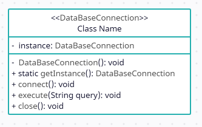

# Patrón Singleton

El patrón de diseño Singleton en Java es un patrón que garantiza
que una clase solo tenga una instancia y proporciona un punto de
acceso global a ella.

Por ejemplo, la clase `DataBaseConnection`:

Esta clase representa una clase para manejar la conexión a una base de datos.
En ella se puede observar que:

- El constructor es un método privado. (Esto evita que se creen instancias directamente
  desde fuera de la clase)
- Existe una variable `instance` estática de tipo `DataBaseConnection` inicializada en `null`.
- Existe un método `getInstance()` estático también, pero público, a través del que se puede acceder
  a la única instancia posible de la clase. En este método se inicializa la variable `instance` si,
  y solo si, la variable se encuentra en `null` en ese momento. (Punto de acceso a la instancia)

Una de las principales desventajas de este patrón de diseño es que no es
*thread-safe*. Para solucionar este problema regresando al ejemplo anterior podemos
optar por la clase `ThreadSafeDataBaseConnection` cuya única diferencia es que
el método estático `getInstance()` utiliza una verificación doble de nulos y un
bloque `synchronized` para garantizar que solo se cree una instancia en un entorno *multi-thread*.

La verificación doble se establece para mitigar la sobrecarga provocada por la ejecución del bloque `synchronized`.

Es importante, como parte del análisis de diseño, valorar las desventajas al utilizar el patrón Singleton
sobre todo en aplicaciones concurrentes.